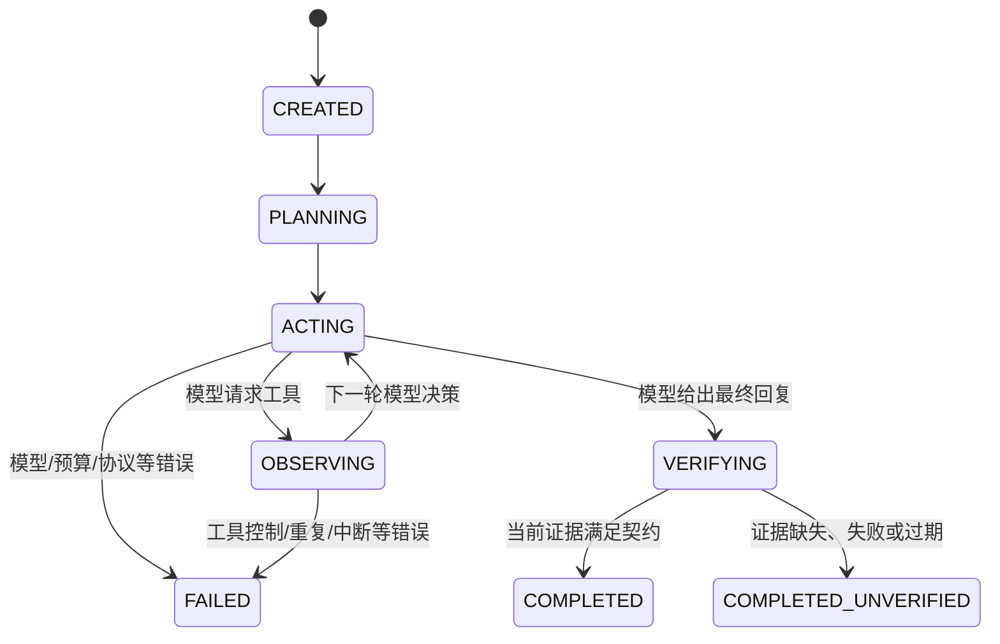
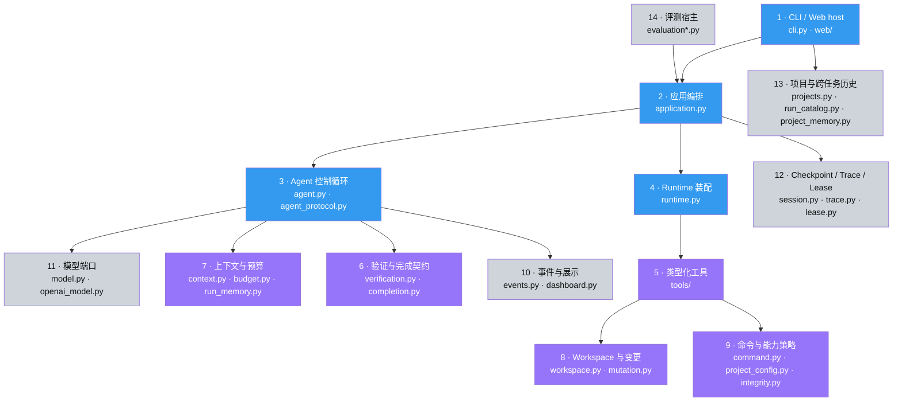

# Relay Coding Agent：从一次任务看懂完整工作流与架构

这是一份面向第一次阅读本项目的人写的中文导览。它回答三个问题：

1. 用户点击“启动智能体”后，程序到底做了什么？
2. 大模型、Agent、工具、验证器、Web 界面分别负责什么？
3. 想修改某项行为时，应该从哪个模块开始读？

如果只记一句话，请记住：

> **大模型提出下一步动作；Relay 宿主校验、执行并观察动作；只有宿主掌握的当前证据才能判定任务完成。**

因此，本项目并不是“把仓库一次性发给模型，让模型吐出一坨代码”，而是一个可观察、可恢复、有边界的闭环执行系统。

## 1. 先建立正确的心智模型

可以把 Relay 看成一个离散反馈控制系统：

| 控制系统概念 | Relay 中的对应物 |
|---|---|
| 被控对象 | 当前项目工作区 |
| 状态 | 文件、对话、计划、预算、当前验证证据 |
| 控制器 | `AgentRunner` |
| 决策策略 | 大语言模型 |
| 执行器 | 文件、命令、计划等工具 |
| 传感器 | 文件读取结果、命令输出、测试结果、Diff |
| 反馈 | 结构化的 `ToolExecution`，作为下一轮模型观察 |
| 终止判据 | 预算/停止策略与 Verification Gate |
| 示波器 | CLI/Web Dashboard 和 JSONL trace |

这一区分非常重要：**大模型不是整个 Agent。** 大模型只是循环中可替换的决策组件；真正让它能够在仓库中可靠工作的，是外层运行时提供的状态机、工具协议、路径约束、变更事务、预算、持久化和验证门。

可以用一个简化方程描述每一轮：

`下一动作 = Model(任务, 有界历史, 当前计划, 最近观察, 工具说明)`

`新状态 = Host(旧状态, 经校验的下一动作, 真实工具结果)`

模型可以建议“写文件”或声称“测试通过”，但它不能直接修改磁盘，也不能自行授予 `VERIFIED`。

## 2. 以 RouteForge 修复任务为例

假设用户在 Web 界面选中 RouteForge，然后输入：

> 修复加权路径规划、路径渲染和状态栏显示，并运行测试与无界面冒烟检查。

一次理想运行大致经历下面的链路：

```text
选择项目
  → 创建运行身份并冻结项目根目录
  → 加载项目验证策略
  → 组装模型、工具、检查点、trace 与 AgentRunner
  → 模型制定计划
  → 列目录 / 读文件 / 搜索符号
  → 运行当前测试，取得失败基线
  → 定位算法与渲染数据契约
  → 带文件修订号写入或替换文本
  → 旧验证证据立即失效
  → 重跑 pytest
  → 重跑独立的 weighted-route smoke
  → 模型给出自然语言总结
  → Verification Gate 判断证据是否覆盖完成契约
  → 保存终态并展示最终回复
```

逐项看，它实际做了这些事：

1. **WebWorkbench 选择项目。** 根目录由服务端持有，任务请求本身不能偷偷换根目录；项目 ID 和目录指纹把历史绑定到这一个物理工作区。
2. **为任务创建 run ID。** RunCatalog 保存任务标题、项目、目录指纹和可选的父任务 ID；RunLease 防止两个进程同时继续同一个运行。
3. **加载 `.coding-agent/project.toml`。** Runtime 将声明编译成受保护路径、确定的 Python 解释器、精确验证命令、验证范围和完成契约。
4. **构造系统提示词。** 它告诉模型有哪些工具、运行预算、修改规则和必须满足的验证范围；若启用 ProjectMemory，只会注入少量明确标成“不可信历史”的摘要。
5. **请求模型做一次决策。** 模型返回自然语言、一个或多个结构化工具调用，或者两者；SDK 不会代替本项目自动执行工具。
6. **宿主先审查工具批次。** 检查调用 ID、参数 JSON、单轮数量、累计预算、当前轮允许的用途，以及该命令是否真的是登记过的验证器。
7. **按顺序执行工具。** 例如先 `read_file`，再 `replace_text`；每个结果都会成为下一轮模型可以观察到的结构化消息。
8. **文件修改形成可审计变更。** 写入前检查路径、链接、受保护文件和期望修订；提交使用原子替换，并生成 change ID、哈希、增删行与 Diff。
9. **任何修改使旧证据过期。** “修改前测试通过”不能证明“修改后仍然通过”；VerificationLedger 进入新 epoch。
10. **只有精确匹配的验证命令才能产出可信证据。** 普通 `python ...` 或模型文本即使退出码为 0，也不能冒充项目登记的 pytest/smoke。
11. **模型最后停止调用工具并给出总结。** 如果代码已经变更但它过早收尾、验证仍缺失，宿主会在预算内进行有界纠偏并请求最小验证批次，而不是立刻接受结论；验证失败后则退回工作阶段继续修复。
12. **Verification Gate 独立判定终态。** 所有必需范围在当前 epoch 通过且完整性仍成立，才是 `COMPLETED`；否则有最终回复也只能是 `COMPLETED_UNVERIFIED`。

因此，界面中的卡片不是装饰性日志，而是这条控制链的投影：

| 界面内容 | 运行时事实 |
|---|---|
| “正在选择下一步” | 即将或正在进行一次模型决策 |
| “正在运行 read_file” | 一个经协议校验的工具调用已开始 |
| “replace_text 已完成” | 文件事务已提交，并产生一条变更记录 |
| Diff 卡片 | MutationSession 返回的有界变更预览 |
| “旧验证证据已失效” | 工作区变更导致 VerificationLedger epoch 前进 |
| “已记录通过证据” | 精确登记的验证器在当前修订上成功 |
| “验证门已评估” | 宿主根据证据与完成契约计算终态 |
| 最终回复 | 模型的解释，不等同于验证结论 |

## 3. 主循环究竟在循环什么

核心在 [agent.py](../src/coding_agent/agent.py)，协议辅助逻辑在 [agent_protocol.py](../src/coding_agent/agent_protocol.py)。下面的伪代码省略了展示细节，但保留了主要控制分支：

```python
initialize_transcript_or_restore_checkpoint()
initialize_budget_run_memory_and_empty_verification_ledger()

for model_turn in cumulative_budget:
    choose_turn_purpose()          # work / verification / final
    prepare_bounded_model_view()   # 不改动 canonical transcript
    response = call_model_with_host_owned_retries()

    if response_is_premature_final_and_current_verification_is_missing:
        append_one_host_closeout_instruction()
        save_ready_checkpoint()
        continue

    append_valid_response_to_canonical_transcript()

    if response.has_tool_calls:
        validate_the_entire_batch_before_any_call_runs()
        for call in response.tool_calls:
            execute_one_typed_tool()
            append_bounded_tool_observation()
            update_run_memory_and_verification_ledger()
            stop_if_cancelled_terminal_or_repeating()
        save_ready_checkpoint()
        continue

    report = evaluate_verification_gate()
    save_terminal_checkpoint()
    emit_terminal_event()
    return completed_or_completed_unverified

return failed_max_steps
```

这里有四个容易忽略的设计点：

- **一个 step 是一次模型决策轮次，不是一次工具调用，也不是修改一个文件。**
- 模型一次可以提出多个工具，但整个批次先原子准入，再按顺序执行；超过单轮上限的批次不会先执行一半。
- 模型看到的是有界视图，canonical transcript 则保持完整并用于检查点；上下文压缩不会改写历史事实。
- 工具结果分成“给模型看的有界观察”和“给宿主控制逻辑的事实”。模型看见的输出即使被裁剪，宿主仍用原始结构化控制事实更新验证与 trace。

## 4. 状态机：为什么界面会显示这些阶段



各状态的含义：

| 状态 | 含义 |
|---|---|
| `CREATED` | 新运行身份已经建立 |
| `PLANNING` | 初始任务与系统策略已经进入 transcript |
| `ACTING` | 正在准备上下文或请求模型选择动作 |
| `OBSERVING` | 正在执行工具、记录结果，或位于下一轮前的稳定边界 |
| `VERIFYING` | 不再调用工具，宿主正在评估最终证据 |
| `COMPLETED` | 最终回复存在，且当前证据满足完成契约 |
| `COMPLETED_UNVERIFIED` | 最终回复存在，但证据不够可信或不完整 |
| `FAILED` | 因控制错误、预算、模型错误或中断而停止 |

`COMPLETED_UNVERIFIED` 不是程序崩溃。它表达的是：“模型已经回答，但宿主没有足够证据替它背书。” 这个区分比把所有退出都显示为成功或失败更诚实。

`PLANNING` 也是生命周期名称，不代表系统里还藏着一个独立 Planner。模型是否显式维护计划，取决于它有没有调用 `update_plan`。

## 5. 模型能做什么，不能做什么

模型边界由 [model.py](../src/coding_agent/model.py) 定义，真实适配器位于 [openai_model.py](../src/coding_agent/openai_model.py)。

模型每次只接收：

- 当前有界消息视图；
- 项目自有的 function tool schemas；
- 系统策略中的边界与预算。

模型每次只返回：

- `content`：自然语言内容；
- `tool_calls`：带唯一 ID、工具名和 JSON 参数的结构化请求。

适配器只做传输和格式映射，不拥有 transcript，不自动调用工具，不决定重试策略，也不决定成功。这样既能替换不同的 Responses-compatible 模型，又避免 provider SDK 悄悄拥有本项目的控制流。

主要异常分支如下：

- **暂时性网络/超时错误：** `AgentRunner` 做有界指数退避，SDK 内建重试关闭。
- **可恢复的工具参数协议错误：** 错误响应不进入 canonical transcript；宿主构造一次临时纠错视图并重新请求。
- **未知异常或重试耗尽：** 运行以 `MODEL_ERROR` 失败。
- **重复的 tool call ID：** 为保护 transcript 对应关系，直接拒绝。
- **模型过早总结：** 若已经改过文件且缺少当前验证，宿主在预算允许时最多进行三次有界收尾纠偏；验证失败会重新开放修复工具，而不是困在只验证模式。

若一个有效响应同时包含 `content` 和 `tool_calls`，它仍是工具轮次：文本与调用一起进入 assistant message，宿主继续执行工具。只有完全不含工具调用的响应才被视为最终回复并进入 Verification Gate。

## 6. 九个内置工具及其角色

工具基类和注册器在 [tools/base.py](../src/coding_agent/tools/base.py)，运行时装配在 [runtime.py](../src/coding_agent/runtime.py)。

| 工具 | 作用 | 是否改变工作区 |
|---|---|---:|
| `list_files` | 有界列出目录内容 | 否 |
| `read_file` | 读取文本及当前文件修订信息 | 否 |
| `search_text` | 在工作区内搜索文本 | 否 |
| `create_directory` | 显式创建一个缺失目录层级 | 是 |
| `write_file` | 新建或整体写入文本文件 | 是 |
| `replace_text` | 对确定文本片段做定点替换 | 是 |
| `undo_change` | 撤销本轮 MutationSession 中的一条变更 | 是 |
| `run_command` | 用直接 argv 启动本地进程 | 可能 |
| `update_plan` | 更新结构化执行计划 | 否 |

所有工具参数都由 Pydantic 严格校验，未知字段会被拒绝；所有工具结果都归一化为 `ToolExecution`，包含成功与否、有界输出/错误、耗时、公开元数据以及宿主专用控制事实。

“宿主专用控制事实”包括：

- 是否产生了进展；
- 是否让旧验证失效；
- 是否产生了 test/build/check 证据；
- 是否触发必须停止的控制错误。

它们由工具实现产生，而不是从模型文本中解析，因此模型无法通过说一句“passed”伪造验证状态。

普通工具失败通常只是下一轮可见的 observation，不会立即杀死整个 Agent。一个已经准入的多调用批次会继续按顺序执行；只有协作取消、终端级命令控制故障或重复无进展策略触发时，后续调用才会被取消并补齐结构化取消结果。

## 7. 文件是怎样安全修改的

文件路径边界在 [workspace.py](../src/coding_agent/workspace.py)，事务与 Diff 在 [mutation.py](../src/coding_agent/mutation.py)。

一次 `replace_text` 不是简单的文件覆写：

1. 将模型给出的相对路径解析到冻结的工作区根目录；
2. 拒绝越界路径、链接/重解析点、受保护路径和不支持的文件形态；
3. 读取快照，得到文件身份、内容哈希和版本；
4. 检查模型提交的期望修订，防止“读到旧文件后覆盖新内容”；
5. 验证替换目标是否唯一、编码/换行和大小是否可接受；
6. 在提交瞬间再次检查快照仍然是当前版本；
7. 通过同目录临时文件与原子替换提交；
8. 生成 `change_id`、前后哈希、增删行、mutation revision 和 Diff；
9. 通知 VerificationLedger 旧证据失效。

这相当于简化的 compare-and-swap：**先基于某个版本做决定，只有版本仍匹配时才提交。** 它解决的是并发覆盖、路径逃逸和半写入问题，不是完整的 Git 事务，也不是操作系统沙箱。

`undo_change` 只认识当前进程内 MutationSession 的变更日志。重新启动或恢复检查点后，文件仍保留，但内存中的 undo journal 不会被冒充为可恢复事实。

## 8. 命令是怎样运行和分类的

相关实现位于 [command.py](../src/coding_agent/command.py)、[command_verification.py](../src/coding_agent/command_verification.py) 和 [tools/command.py](../src/coding_agent/tools/command.py)。

Relay 使用参数向量直接启动进程，不把模型字符串交给 shell 解释。命令先被 `CommandPolicy` 分为：

- **登记验证命令：** argv、cwd、解释器身份等与项目策略精确匹配，可在完整性检查通过时产生验证证据；
- **普通命令：** 在 `safe` 模式下需要宿主批准；当前 Web 没有批准代理，所以普通命令拒绝；`auto` 模式跳过交互批准；
- **禁止命令：** 即使在 `auto` 中也会被拒绝的已知危险类别。

进程运行器还负责：

- 将 cwd 限制为工作区内的相对位置；
- 清理传入环境中的凭证类变量；
- 对登记验证器使用更严格的验证环境；
- 限制运行时间和输出字节数；
- 在超时/控制失败时终止进程树；
- 将退出状态、耗时和有界 stdout/stderr 变成结构化结果。

需要再次强调：`auto` 是“自动批准普通命令”，不是“安全地运行任意恶意仓库”。真正不可信的项目仍应放进容器、虚拟机或低权限账户。

## 9. 可信验证到底可信在哪里

可以先把整个裁决链记成三层：

| 层级 | 回答的问题 | 核心机制 |
|---|---|---|
| 1. VerificationLedger | 这条精确登记的检查真的在当前代码版本通过了吗？ | 命令身份、真实退出状态、integrity、epoch |
| 2. CompletionContract | 当前通过的检查覆盖任务要求了吗？ | required labels、kinds、scopes、target runtime |
| 3. Evaluate oracle | 在固定评测中，是否真的修好且没有绕过公开测试？ | sibling oracle、全仓 manifest、变更 allowlist |

前两层用于普通 CLI/Web 项目运行；第三层是 `coding-agent evaluate` 的额外宿主判分。

可信验证由四层共同完成：

1. [project_config.py](../src/coding_agent/project_config.py) 读取严格的项目声明；
2. [integrity.py](../src/coding_agent/integrity.py) 绑定配置、解释器和受保护路径；
3. [verification.py](../src/coding_agent/verification.py) 维护当前 revision epoch 的证据账本；
4. [completion.py](../src/coding_agent/completion.py) 检查证据是否覆盖完成契约。

一个典型项目策略是：

```toml
schema_version = 1
protected_paths = ["tests/", "checks/", "pyproject.toml"]

[python]
executable = ".venv/Scripts/python.exe"

[[verifiers]]
label = "pytest"
type = "pytest"
cwd = "."
scopes = ["tests"]
required = true

[[verifiers]]
label = "weighted-route-smoke"
type = "python-module"
module = "checks.route_smoke"
cwd = "."
scopes = ["runtime:weighted-route", "runtime:render-contract"]
required = true

[completion]
required_scopes = ["tests", "runtime:weighted-route", "runtime:render-contract"]
```

要得到 `VERIFIED`，并不只是“某条命令退出码为 0”，而是同时满足：

- 调用与宿主预先登记的验证 capability 精确匹配；
- 使用的目标解释器是项目显式声明且身份仍匹配的解释器；
- 配置和受保护测试/检查文件在验证前后都未变化；
- 命令正常完成并真实收集、通过预期检查；
- 证据属于最新 workspace epoch，而不是某次修改之前；
- 每个 completion required scope 都被当前通过证据覆盖；
- 目标 runtime 被允许用于任务验证。

“可信”描述的是**证据来源、完整性、新鲜度和覆盖范围**，不是数学意义上的程序完全正确。测试契约没覆盖的需求，系统也无法凭空证明。

还要区分两个“成功”：

- `ToolExecution.ok = true` 表示命令工具本身被正常调用并观察到结果；
- 被运行进程的 `exit_code = 0` 且满足验证能力和完整性要求，才会记录通过证据。

所以 pytest 以退出码 1 正常结束时，工具调用可以是成功的，但测试证据是失败的。这种失败是有价值的反馈，不是通信故障。

没有 `.coding-agent/project.toml` 时，系统仍可运行默认 pytest，但宿主 Python 不会被自动当作项目真实 runtime；结果可以说明 checks 通过，却不会无条件升级成完整任务验证。

## 10. 上下文和三种“记忆”

这是最容易混淆、也最值得理解的一部分。

### 10.1 Canonical transcript：本轮运行的完整对话事实

它包含 system/user/assistant/tool 消息及工具调用对应关系，是同一 run 的规范历史。检查点保存它；上下文压缩不会就地改写它。

### 10.2 Model view：某一轮实际送给模型的有界视图

[context.py](../src/coding_agent/context.py) 根据字符预算生成视图。系统提示、原始任务、工具 schema 和完整消息块边界是重要锚点；过旧工具块可以压成“调用了什么、成功与否、错误码、是否裁剪”等事实，最近完整块优先保留。

因此：

> canonical transcript 是“发生过什么”；model view 是“这一轮模型能看见什么”。

### 10.3 RunMemory：同一运行里的结构化工作记忆

[run_memory.py](../src/coding_agent/run_memory.py) 有界保存：

- 当前计划；
- 按路径合并的文件变更元数据；
- 最近失败命令的身份；
- 历史验证提示。

它不保存源码、完整 Diff、原始命令输出或模型隐藏推理。恢复同一 run 时它与 transcript、累计预算一起恢复，但历史验证只能作提示，不能恢复 VerificationLedger 的权威。

### 10.4 ProjectMemory：跨任务的历史摘要

[project_memory.py](../src/coding_agent/project_memory.py) 保存少量终态摘要，并同时绑定 project ID 和 workspace fingerprint。新任务可以按相关性/时间选入若干条；“继续已完成任务”则强制引用指定父任务摘要。

ProjectMemory 只是一张贴在控制台旁的旧便签：

- 可以提醒模型上一次做过什么；
- 不能授权工具；
- 不能恢复预算或 provider 状态；
- 不能满足当前验证门；
- 必须重新读当前文件、重新运行验证。

### 10.5 五者对比

| 数据 | 生命周期 | 是否完整 | 能否决定当前 VERIFIED |
|---|---|---:|---:|
| canonical transcript | 一个 run | 规范消息历史 | 否 |
| model view | 一次模型请求 | 有界、可压缩 | 否 |
| RunMemory | 一个 run，可随检查点恢复 | 有界结构化事实 | 否 |
| ProjectMemory | 同一项目的多个 run | 有界终态摘要 | 否 |
| VerificationLedger | 当前进程、当前 workspace epoch | 当前验证证据 | **可以，结合 CompletionContract** |

## 11. 检查点、trace、目录历史分别保存什么

持久化并非一个万能 JSON，而是刻意拆成几种“不同的真相”：

| 存储 | 主要模块 | 用途 | 不可用于 |
|---|---|---|---|
| Session checkpoint | [session.py](../src/coding_agent/session.py) | 恢复同一 run 的 transcript、RunMemory 和预算 | 历史展示、自动重放工具、继承验证 |
| JSONL trace | [trace.py](../src/coding_agent/trace.py) | 追加式审计事实和历史回放 | 授权命令、恢复私有 transcript |
| Project registry | [projects.py](../src/coding_agent/projects.py) | 左栏项目导航与目录绑定 | Agent 决策 |
| Run catalog | [run_catalog.py](../src/coding_agent/run_catalog.py) | 任务列表、项目归属、父子 lineage、记忆来源 | 工具执行与验证 |
| ProjectMemory | [project_memory.py](../src/coding_agent/project_memory.py) | 跨任务的有界参考摘要 | 当前任务完成证明 |
| Run lease | [lease.py](../src/coding_agent/lease.py) | 阻止两个进程同时拥有同一 run | 保存业务上下文 |

默认这些数据位于操作系统的用户状态目录，而不写进 Agent 可编辑的仓库；也可以通过 `CODING_AGENT_STATE_DIR` 或 `--state-dir` 指定绝对路径。

Windows 默认布局如下：

```text
%LOCALAPPDATA%\coding-agent\
├── projects.json
├── runs\<run-id>.json
├── traces\<run-id>.jsonl
├── sessions\<run-id>.json
├── project-memories\<project-id>.json
└── leases\<run-id>.lock
```

### “恢复”和“继续”不是一回事

| 操作 | 适用对象 | run ID | 继承什么 | 必须重新做什么 |
|---|---|---|---|---|
| 恢复 | 在 `READY_FOR_MODEL` 边界中断的任务 | 不变 | transcript、RunMemory、已消费预算 | 当前验证 |
| 继续 | 已完成任务的后续需求 | 新建 | 父 ID 与父任务 ProjectMemory 摘要 | 读取、修改、预算、验证全部按新 run 执行 |

恢复前会检查项目身份、workspace fingerprint、checkpoint 边界、trace 是否已终结以及 lease。检查点只保存在完整模型/工具块之间，所以恢复不会自动把最后一个工具再执行一次。

但它并非严格的崩溃一致性事务：若进程恰好在“文件已经落盘、下一检查点尚未保存”之间被强杀，磁盘可能领先于 checkpoint。恢复后依靠重新读取和 revision 检查减小误覆盖风险，而不是假装拥有 exactly-once 保证。

## 12. Web/CLI 为什么能共用同一个 Agent

[application.py](../src/coding_agent/application.py) 的 `execute_repository_run()` 是共同应用入口：

```text
CLI run/resume ──────────────┐
                             ├─> RepositoryRunSpec
WebWorkbench/WebRunService ──┘          │
                                       ▼
                           execute_repository_run()
                              ├─ build_runtime()
                              ├─ ModelAdapter
                              ├─ SessionStore
                              ├─ JSONL trace + UI event sink
                              └─ AgentRunner.run()/resume()
```

CLI 和 Web 只负责“怎样接收输入、怎样展示输出”。它们没有各自复制一套 Agent 循环，因此：

- CLI 与 Web 使用相同工具和权限策略；
- 两者的 Diff、验证门和停止原因一致；
- Web 样式变化不会改变 Agent 决策；
- trace 优先写入，渲染故障不会反向改写运行结果。

Web 特有逻辑主要位于：

- [web/workbench.py](../src/coding_agent/web/workbench.py)：项目选择、历史、恢复/继续、全局单任务准入；
- [web/service.py](../src/coding_agent/web/service.py)：一个后台 worker、运行状态和协作取消；
- [web/app.py](../src/coding_agent/web/app.py)：loopback FastAPI、严格请求模型、控制 token 和安全响应头；
- [dashboard.py](../src/coding_agent/dashboard.py)：把运行事件折叠成 CLI/Web 都能理解的有界投影；
- [web/static/](../src/coding_agent/web/static/)：只负责浏览器交互和视觉呈现。

Web 请求只提交任务文本和少量界面选择；项目根目录、模型、base URL、权限模式和预算由启动服务器的宿主持有，浏览器不能逐任务偷偷替换这些控制参数。

## 13. 事件系统与“历史回放”

运行核心只发出 [events.py](../src/coding_agent/events.py) 定义的 `RunEvent`，并不知道卡片长什么样。事件会扇出到：

- `JsonlEventSink`：先保存可审计事实；
- `DashboardEventSink`：渲染 Rich CLI；
- `DashboardProjection`：生成 Web 白名单快照。

Web 并不保存一份独立“动画状态”。实时页和历史页都把事件重新投影，因此同一事实应得到一致卡片。

工作区变更账本会跨同一 run 的所有恢复片段收集 mutation 事件；普通时间线与状态则采用最新片段。每条变更都有独立的 Diff 卡片，UI 折叠不等于底层修改被裁剪。为防止无限增长，浏览器投影仍有明确的行数、条数和输出上限，并报告遗漏计数。

最终自然语言回复来自匹配该工作区的 terminal checkpoint；trace 仍是操作历史。旧版本、损坏或不匹配的 checkpoint 只会导致最终回复缺失，不会让 Web 从不可信 trace 猜出一段“回复”。

## 14. evaluate 模式在额外证明什么

普通 `run/web` 的可信验证依赖目标项目自己声明的测试契约；[evaluation.py](../src/coding_agent/evaluation.py) 则是评测宿主，为固定场景再加一层独立判定：

```text
生成全新的公开红灯 fixture
  → 宿主确认 baseline 确实失败
  → 同一个 Agent 在该临时仓库工作
  → 比较整个仓库前后 manifest
  → 拒绝受保护测试变化和 allowlist 外变化
  → 只把允许的源码复制到兄弟 oracle 目录
  → 加入 Agent 工作区之外的回归测试
  → 用清除凭证的宿主进程运行 oracle
  → 汇总通过率、步数、工具错误和 false-green
```

它主要回答：

- Agent 是否真的修复了任务，而不只是输出“完成”；
- 是否改了要求中的文件；
- 是否篡改公开测试或写了 allowlist 外内容；
- 是否出现“内部 Verification Gate 通过，但独立 oracle 失败”的假绿。

内置场景和 oracle 源码随项目发布，所以这是**独立执行路径**，不是秘密基准。若要真正防止被测代码窥探隐藏测试，需要把 oracle 放到外部容器或服务中。

## 15. 完整分层与推荐阅读顺序

下面箭头从“依赖者”指向“被依赖者”。颜色表示第一次阅读时的顺序，而不是模块好坏：



- **蓝色 1–4：先读。** 先理解入口如何汇合，以及唯一的控制循环在哪里。
- **紫色 5–9：第二轮读。** 理解模型动作怎样变成受约束的真实副作用与可信证据。
- **灰色 10–14：最后读。** 再看适配、展示、持久化、项目连续性和评测。

不要一上来从 `dashboard.py` 或 CSS 倒推 Agent；那相当于通过汽车仪表盘猜发动机控制器，能看到现象，但很难看清因果链。

## 16. 模块地图

| 子系统 | 入口文件 | 一句话职责 |
|---|---|---|
| CLI host | [cli.py](../src/coding_agent/cli.py) | 参数、命令、退出码和 host 选择 |
| 共同应用层 | [application.py](../src/coding_agent/application.py) | 把一次仓库运行需要的组件装到一起 |
| Runtime composition | [runtime.py](../src/coding_agent/runtime.py) | 加载项目策略并注册工具、验证器和工作区 |
| Agent core | [agent.py](../src/coding_agent/agent.py) | 唯一模型—工具反馈循环与状态机 |
| Agent protocol | [agent_protocol.py](../src/coding_agent/agent_protocol.py) | 转移规则、提示约束、批次/收尾和公开事件数据 |
| Domain models | [models.py](../src/coding_agent/models.py) | 跨边界不可变消息、调用、结果和终态类型 |
| Model adapter | [openai_model.py](../src/coding_agent/openai_model.py) | Responses API 传输与协议映射 |
| Context/budget | [context.py](../src/coding_agent/context.py), [budget.py](../src/coding_agent/budget.py) | 有界 model view、轮次/工具/观察预算 |
| Stop/cancel | [stopping.py](../src/coding_agent/stopping.py), [cancellation.py](../src/coding_agent/cancellation.py) | 重复调用停止与安全边界协作取消 |
| Tools | [tools/](../src/coding_agent/tools/) | 工具 schema、参数校验、调用和统一结果 |
| Workspace/mutation | [workspace.py](../src/coding_agent/workspace.py), [mutation.py](../src/coding_agent/mutation.py) | 路径 containment、文件版本、原子提交、Diff、undo |
| Commands | [command.py](../src/coding_agent/command.py) | 直接 argv、权限分类、环境、超时、进程树、输出 |
| Project policy | [project_config.py](../src/coding_agent/project_config.py), [integrity.py](../src/coding_agent/integrity.py) | 解释器/验证器 capability 与受保护 manifest |
| Verification | [verification.py](../src/coding_agent/verification.py), [completion.py](../src/coding_agent/completion.py) | 当前证据账本与完成契约 |
| Persistence | [session.py](../src/coding_agent/session.py), [trace.py](../src/coding_agent/trace.py), [lease.py](../src/coding_agent/lease.py) | 恢复、审计和独占运行 |
| Project continuity | [projects.py](../src/coding_agent/projects.py), [run_catalog.py](../src/coding_agent/run_catalog.py), [project_memory.py](../src/coding_agent/project_memory.py) | 左栏项目/任务和跨任务摘要 |
| Web host | [web/](../src/coding_agent/web/) | 本地项目工作台、后台 worker、HTTP 和浏览器 UI |
| Presentation | [dashboard.py](../src/coding_agent/dashboard.py) | 从事件构建有界、脱敏、只读的显示投影 |
| Evaluation | [evaluation.py](../src/coding_agent/evaluation.py), [evaluation_scenarios.py](../src/coding_agent/evaluation_scenarios.py) | fixture、baseline、独立 oracle 和指标 |

### 16.1 用户直接接触的模块

`cli.py` 和 `web/` 是宿主入口：前者用 Typer/Rich 接收命令行任务，后者用 FastAPI 与静态页面提供项目工作台。它们依赖 `application.py` 进入共享执行路径，而不依赖具体工具实现来另造一套循环。`dashboard.py` 位于核心事件与界面之间，是 CLI 和 Web 的只读翻译层；修改显示字段时通常要同步检查 Dashboard、Web response model 和 JS 渲染测试。

### 16.2 核心业务逻辑

`agent.py`、`agent_protocol.py`、`models.py` 共同定义 Model–Tool–Observation 控制循环及合法状态；它们依赖抽象 `ModelAdapter`、`ToolDispatcher` 和 EventSink，而不应依赖 FastAPI 或 Rich。`context.py`、`budget.py`、`run_memory.py`、`stopping.py` 和 `cancellation.py` 为循环提供有界控制状态。`tools/` 将模型动作翻译成 Workspace、MutationSession 和 CommandPolicy 能执行的能力；`verification.py` 与 `completion.py` 在模型之外裁决任务完成。

### 16.3 基础设施与外围模块

`openai_model.py` 是 provider transport adapter；`session.py`、`trace.py`、`state.py` 和 `lease.py` 负责本地持久化与进程所有权；`projects.py`、`run_catalog.py` 和 `project_memory.py` 提供 Web 项目连续性。`evaluation*.py` 是最外层评测宿主，它依赖生产应用入口运行同一个 Agent，再使用独立 oracle 判分。这些模块可以依赖核心抽象，但核心控制循环不应反向依赖 Web、具体 provider 或评测场景。

## 17. 所有主要终止分支

| StopReason | 什么时候发生 | 是否可能恢复 |
|---|---|---|
| `FINAL_RESPONSE` | 模型不再请求工具，Verification Gate 已评估 | 已终结；后续应“继续”成新 run |
| `MAX_STEPS` | 累计模型轮次耗尽或恢复预算小于已消费量 | 有 ready checkpoint 时可提高上限恢复 |
| `TOOL_LIMIT` | 工具预算耗尽，或模型连续提交不允许的批次 | 视 checkpoint 与 trace 状态 |
| `MODEL_ERROR` | provider 错误耗尽、协议不可恢复、重复 call ID 等 | 通常可从 ready checkpoint 恢复 |
| `USER_INTERRUPTED` | Ctrl+C、Web 关闭后的协作取消 | 设计目标就是保留 ready checkpoint |
| `COMMAND_CONTROL_FAILED` | 命令进程树无法可靠收束等控制失败 | 先人工检查进程与工作区 |
| `CONTEXT_LIMIT` | 连锚点/压缩事实都无法装进配置的上下文预算 | 需减小任务/历史或调整实现预算 |
| `REPEATED_TOOL_CALL` | 同一调用连续得到同一观察，疑似陷入循环 | 检查提示、工具反馈或模型能力 |

此外，工具本身失败通常不会立刻结束运行。它会成为一条结构化观察，让模型有机会改参数、换路径或修复后重试；只有控制事实要求终止、停止策略触发或总预算耗尽才结束。

## 18. 预算、停止和取消怎样避免失控

默认情况下，`--max-steps` 限制模型决策轮次；累计工具容量按 `max(8, 2 × max_steps)` 扩展，单个模型响应仍最多提出 8 个调用。存在 CompletionContract 时，系统会预留验证调用、验证轮次和一个纯最终回复轮次，避免前期探索把收尾容量全部耗光。

一次模型轮次可能包含初始请求及若干宿主拥有的恢复尝试，所以“模型轮次”不等于“HTTP 请求次数”。传输重试和参数协议纠错会产生可观察事件，但不会偷偷增加一个业务 step。

额外停止规则包括：

- 连续多次相同工具名、相同参数得到相同观察时，判定可能陷入循环；
- 明确产生进展的工具会重置重复计数；
- 连续提交超限或用途不允许的工具批次会停止，而不是无限纠正；
- 命令进程树无法可靠收束时 fail closed；
- 上下文连必要锚点和压缩事实都装不下时停止，而不是静默丢掉任务。

取消是 cooperative cancellation。Agent 会在模型请求前后、重试等待期以及两个工具调用之间检查 token，并在完整协议边界保存 `READY_FOR_MODEL` checkpoint。若 provider 或工具正在阻塞，宿主不能凭空让普通 Python 调用安全消失，只能等待它返回后再观察取消；这是协作取消的现实边界。

## 19. 系统明确不保证什么

边界写清楚，反而比“全能 Agent”更可信：

- **它不是操作系统沙箱。** 项目测试和 module verifier 都是在本机执行的代码；恶意仓库需要外部隔离。
- **它不能把弱模型自动变成强模型。** 宿主能限制副作用、揭露失败并拒绝假验证，但定位、设计和编码质量仍受模型能力影响。
- **验证不是形式化证明。** Scope 是项目声明的语义标签，不是系统自动计算出的需求覆盖率。
- **项目 verifier 本身需要可信。** 被登记的 Python module 依然可以执行任意 Python 行为。
- **解释器哈希不是整个环境哈希。** 当前会绑定解释器身份，但不会冻结完整 site-packages、系统库和依赖闭包。
- **保护范围依赖项目声明。** 普通项目若漏掉 pytest 控制文件，宿主不会凭空知道它应该受保护；evaluate 对固定场景有更强的内建清单。
- **Trace 是审计记录，不是防篡改账本。** 它可严格读取和回放，但历史事件永远不能重新授权工具或验证。
- **恢复不是 exactly-once 分布式事务。** 强杀窗口中磁盘可能领先于最后 checkpoint。
- **Sibling oracle 是执行路径隔离，不是安全隔离。** 真正敌对的候选代码仍需要外部容器/服务。

## 20. 代码库约定

阅读和扩展时，优先保持这些约定：

- **命名遵循 Python 常规。** 文件、函数和变量使用 `snake_case`，类型使用 `PascalCase`，枚举成员使用 `UPPER_SNAKE_CASE`；`_workspace/`、`_dashboard_*.py` 等前导下划线模块表示包内实现细节。
- **目录是混合式组织。** Agent 核心以顶层模块呈现；工具、Web 和 Workspace 平台细节因内聚性较强而使用子包，不强行把所有代码塞进纯 MVC 或纯 Clean Architecture 目录。
- **跨边界数据优先使用不可变类型。** Pydantic/冻结 dataclass 让模型、工具、存储和 UI 之间的形状可验证。
- **错误带稳定 code。** 预期边界错误通常继承 `CodedError` 或变成结构化 `ToolExecution`；用户文案可以变化，控制流和测试不应依赖脆弱的完整异常字符串。
- **所有不受信数据都必须有界。** 模型输出、文件内容、命令输出、trace、JSON、Diff 和 UI 列表均有明确上限。
- **内容与控制事实分离。** 模型可读文本不能同时充当授权或验证信号。
- **依赖通过 Protocol/工厂注入。** 测试可使用 ScriptedModel、假 runner、假时钟，而不访问网络。
- **事件是事实，投影是视图。** Dashboard 不应反向影响 Agent 结果。
- **状态默认放在工作区外。** Agent 的文件工具不能改写自己的 checkpoint、trace 或项目目录注册表。
- **顺序优先于炫技并发。** 文件操作相互依赖；当前工具批次有意顺序执行。
- **测试通常与模块镜像。** 修改控制逻辑时，应寻找 `tests/test_<module>.py` 以及对应 Web/JS 测试。

## 21. 修改时的危险区

这些不是“坏文件”，而是影响面大、需要带着不变量一起修改的区域：

| 区域 | 为什么危险 | 最低验证建议 |
|---|---|---|
| `agent.py` / `agent_protocol.py` | 改一处分支可能破坏 transcript 配对、预算、终态事件顺序 | Agent、budget、context、session、dashboard 相关测试 |
| `workspace.py` / `mutation.py` | 路径和 TOCTOU 错误可能造成越界或覆盖用户数据 | Workspace/mutation 全套测试，尤其 Windows 路径 |
| `command.py` / `integrity.py` | 会改变本地命令权限和验证证据可信度 | command、policy、integrity、completion 测试 |
| `session.py` / `project_memory.py` | 涉及版本迁移、目录绑定和不可信历史 | 恢复、损坏输入、workspace mismatch 测试 |
| `dashboard.py` / `web/workbench.py` | 容易把“展示方便”误升级为“运行权威” | Python Web 测试与 `tests/js/` |
| `evaluation.py` | 一个小漏洞会让指标假绿或允许篡改测试 | baseline、oracle、manifest、false-green 测试 |

本项目中几个文件较长，是因为它们承载密集不变量。重构时应优先按“策略 / 纯投影 / 平台适配”抽取，而不是只追求行数变少；错误的切分会让控制流在更多文件间跳跃，反而更难审计。

一个当前展示边界也应明确：变更账本完整记录的是 `write_file`、`replace_text` 与 `undo_change` 产生的工具事件。若普通 `run_command` 启动的外部脚本自行改写文件，系统没有操作系统级文件监控去自动补出逐文件 Diff 卡片；演示可审计变更时应优先使用显式 mutation tools。

## 22. 术语表

| 术语 | 本项目中的含义 |
|---|---|
| Agent | 模型、控制循环、工具、状态与策略组成的整体 |
| Model turn / step | 一次模型决策轮次；不是一次工具调用 |
| Tool call | 模型提出的结构化动作请求 |
| Tool execution/observation | 宿主真实执行后的结构化结果 |
| Canonical transcript | 同一 run 的规范消息与工具对应历史 |
| Model view | 某轮在预算内实际发给模型的上下文 |
| Workspace | Agent 被允许解析和操作的冻结项目根目录 |
| Mutation revision | 本轮文件事务的递增版本，用于检测旧读写 |
| Verification evidence | 登记验证器在某个当前 epoch 产生的结果 |
| Verification epoch | 工作区每次可能改变后推进的证据版本 |
| Completion contract | 声明任务完成必须覆盖哪些验证 scope |
| Checkpoint | 可恢复同一 run 的被动快照 |
| Trace | 用于审计和回放的追加式事件记录 |
| RunMemory | 同一 run 内跨压缩/恢复的结构化事实 |
| ProjectMemory | 同一项目不同 run 之间的不可信有界摘要 |
| Projection | 从内部事件派生的 CLI/Web 展示视图 |

## 23. 新开发者适合先做什么

按学习收益和风险从低到高：

1. **展示层小改动。** 给一个已有 RunEvent 增加更清楚的中文解释，同时补 Python projection 与 JS 渲染测试。可以学会“事实—投影—UI”的边界。
2. **只读工具增强。** 为 `read_file` 或 `search_text` 增加一个严格有界、结构化元数据字段，并测试异常路径。可以学会工具 schema 和 observation budget。
3. **补一条验证契约测试。** 构造“先通过、再修改、旧证据必须变 stale”的测试，再扩展成一个小型确定性 evaluate 场景。可以串起证据链，但应先理解完整性约束。

不建议把“修改 AgentRunner 主循环”作为第一个任务。先从边缘向核心走，等能解释每一种 truth 和每一个稳定边界后，再碰控制循环。

## 24. 一分钟答辩版

如果老师问“你们这个 Agent 到底怎么工作”，可以这样回答：

> Relay 把大模型当作一个可替换的决策器，而不是把执行权直接交给模型。每一轮，宿主从完整 transcript、结构化 RunMemory 和工具 schema 中生成有界上下文；模型提出读取、搜索、修改或运行命令等结构化动作。ToolRegistry 校验参数，Workspace 和 MutationSession 约束路径并原子提交变更，CommandPolicy 管理直接 argv 命令和项目登记的验证能力。每个真实结果反馈给下一轮，同时写入审计 trace 和 CLI/Web 投影。文件一旦变化，旧测试证据立即过期；只有当前修订上、完整性未被破坏、覆盖项目 completion scopes 的登记验证器全部通过，Verification Gate 才会显示 VERIFIED。检查点负责恢复同一任务，ProjectMemory 只为新任务提供不可信历史摘要，两者都不能继承验证权威。

继续深入时，再读 [ARCHITECTURE.md](ARCHITECTURE.md) 的精确定义和 [SECURITY.md](SECURITY.md) 的威胁边界。
